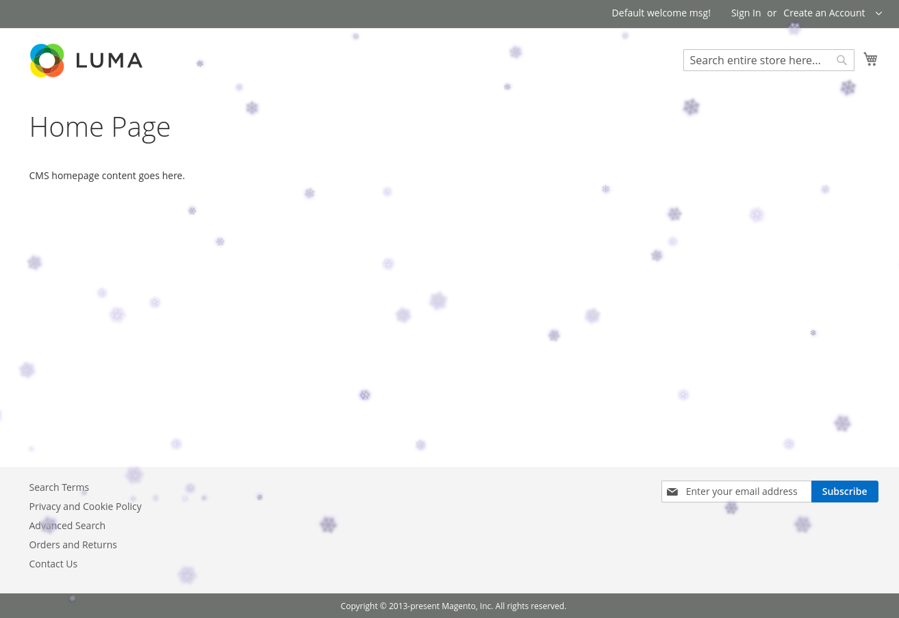
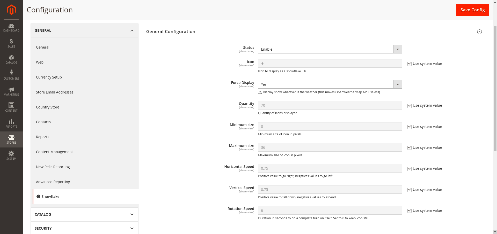
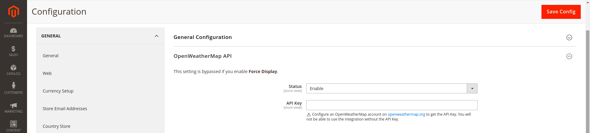

# Snowflake Module for Magento 2

[](https://packagist.org/packages/opengento/module-snowflake)
[](./LICENSE)
[](https://packagist.org/packages/opengento/module-snowflake/stats)
[](https://packagist.org/packages/opengento/module-snowflake/stats)

This fun module adds ❄️️ on your website all the time or based on your visitor outside weather.

- [Setup](#setup)
    - [Composer installation](#composer-installation)
    - [Setup the module](#setup-the-module)
- [Features](#features)
- [Settings](#settings)
- [Documentation](#documentation)
- [Support](#support)
- [Authors](#authors)
- [License](#license)

## Setup

Magento 2 Open Source or Commerce edition is required.

### Composer installation

Run the following composer command:

```shell
composer require opengento/module-snowflake
```

### Setup the module

Run the following magento command:

```shell
bin/magento setup:upgrade
```

**If you are in production mode, do not forget to recompile and redeploy the static resources.**

## Features



### Snowflake base on local meteo

Do you like the snow? Do you like to feel the same weather on your favorite website? Try this plugin and get the snow along your local meteo!

Require: [OpenWeatherMap API key](https://openweathermap.org/).

### Force Snowflake

It doesn't snow everywhere, so you can force snow.

### Hacking Snowflake

You don't like snow, no problem, Snowflake can make it rain [cookies](https://twitter.com/MehdiChch/status/1505649692755079169), [hot-dog](https://twitter.com/MehdiChch/status/1505258061249884160) or whatever you want.

## Settings

The configuration for this module is available in `Stores > Configuration > General > ❄️ Snowflake`.





## Support

Raise a new [request](https://github.com/opengento/magento2-snowflake/issues) to the issue tracker.

## Authors

- **OpenGento Community** - *Lead* - [](https://twitter.com/opengento)
- **Contributors** - *Contributor* - [](https://github.com/opengento/magento2-snowflake/graphs/contributors)

## License

This project is licensed under the MIT License - see the [LICENSE](./LICENSE) details.

***That's all folks!***
